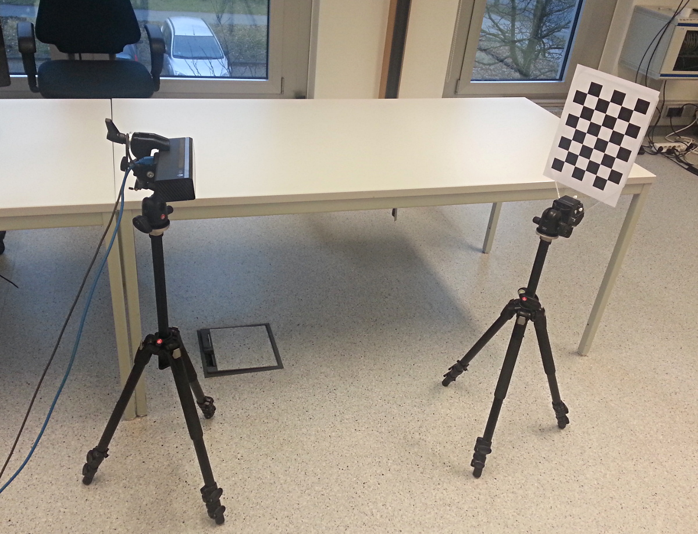
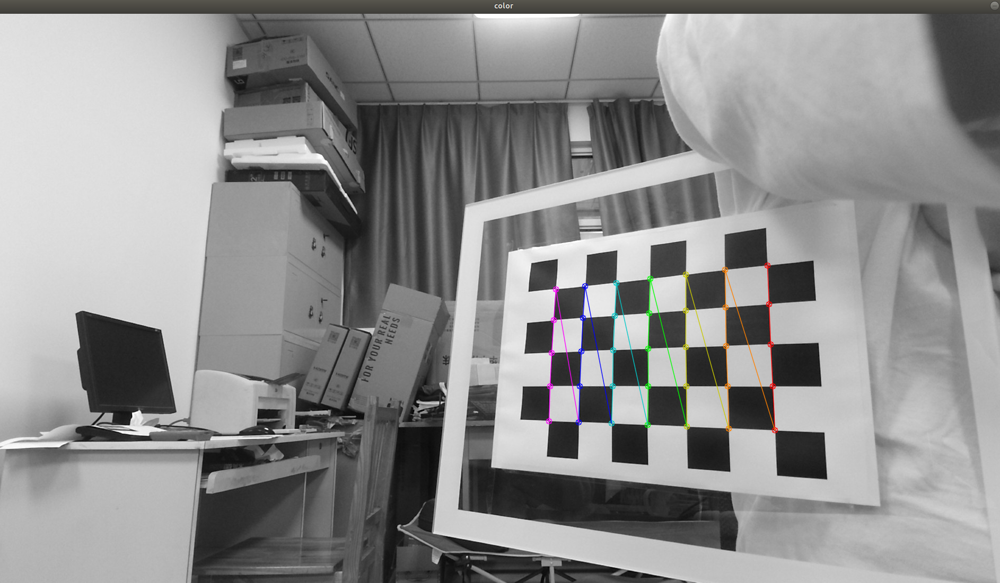

# 一、安装驱动 libfreenect2

## 1.下载源码

```bash
    git clone https://github.com/OpenKinect/libfreenect2.git
    cd libfreenect2
```
libfreenect2下载到主目录

## 2.安装需要的一些环境

(1) 安装build cmake 编译工具
```bash
sudo apt-get install build-essential cmake pkg-config
```
(2).安装libusb
```bash 
sudo apt-get install libusb-1.0-0-dev
```


(3).安装libturbojpeg
```bash 
sudo apt-get install libturbojpeg0-dev
```


(4).安装openGL
```bash 
sudo apt-get install libglfw3-dev
```


(5).安装openCL
```bash 
sudo apt-get install beignet-dev
```

## 3.安装

打开主目录的libfreenect2文件，右击打开终端

    mkdir build
    cd build
    cmake .. -DCMAKE_INSTALL_PREFIX=$HOME/freenect2
    make
    make install

## 4.配置udev规则以获取访问设备的权限

```bash 
sudo cp ../platform/linux/udev/90-kinect2.rules /etc/udev/rules.d/
#上面的运行后，如果提示找不到文件或目录，可以运行下面的命令
sudo cp ～/catkin_ws/src/libfreenect2/platform/linux/udev/90-kinect2.rules /etc/udev/rules.d/
```


然后插拔设备，tips：kinect v2 一定要接到usb 3.0上

## ５.测试安装是否成功

```bash 
cd libfreenect2/build
./bin/Protonect
```


如果看到一个窗口打开，内容为四个画面，则说明安装成功！

# 二、安装OpenNI2

kinect是微软的设备,故专门有kinect.dll,而linux上只有专家开发出来的适配驱动。目前在网上的资料看,OpenNI兼容不了v2,而v2驱动都是由OpenNI2开发的,没有用OpenNI开发的。故对于v1设备,只需要安装OpenNI就可以了,而对于v2设备,则需要安装OpenNI2。

## 1.官网下载

[OpenNI2下载地址](https://structure.io/openni)
终端转到解压目录下，找到install.sh文件，执行

```bash
sudo ./install.sh
```
生成OpenNIDevEnvironment文件，再执行
```bash
cat OpenNIDevEnvironment >> ~/.bashrc
```

这样就把解压文件夹下的Include和Redist路径分别添加给了环境变量`OPENNI2_INCLUDE`和`OPENNI2_REDIST`
`source ~/.bashrc` 一下，用echo指令查看

## 2.安装OpenNI2

```bash
cd /OpenNI-Linux-x64-2.2.0.33/OpenNI-Linux-x64-2.2
sudo cp -r ./Include /usr/include/openni2
cd Redist/
sudo cp libOpenNI2.jni.so /usr/lib/
sudo cp libOpenNI2.so /usr/lib/
```

## 3.检验OpenNI2是否安装成功

```bash
pkg-config --modversion libopenni2
```

显示安装版本表示安装成功。
# 三、安装 iai_kinect2

## 1.首先创建一个ros工作空间/并完成初始化：

```bash
mkdir -p ~/catkin_ws/src
cd ~/catkin_ws/src
catkin_init_workspace
cd ..
catkin_make
```

## 2.在ROS环境里使用Kinect2， 主要依靠iai-kinect2这个包。利用命令行从Github上面下载工程源码到工作空间内src文件夹内:

```bash
#还是到刚才那个工作空间
cd ~/catkin_ws/src/
git clone https://github.com/code-iai/iai_kinect2.git
cd iai_kinect2
rosdep install -r --from-paths . #注意最后这还有个点
cd ~/catkin_ws
catkin_make -DCMAKE_BUILD_TYPE="Release"
```

<font color='red'>错误：</font>在运行 rosdep install -r --from-paths . 出问题了。

```bash
ERROR: the following packages/stacks could not have their rosdep keys resolved
to system dependencies:
kinect2_viewer: Cannot locate rosdep definition for [kinect2_bridge]
iai_kinect2: Cannot locate rosdep definition for [kinect2_registration]
kinect2_calibration: Cannot locate rosdep definition for [kinect2_bridge]
kinect2_bridge: Cannot locate rosdep definition for [kinect2_registration]
```
<font color='green'>解决：</font>

```bash
#将原来的：
rosdep install -r --from-paths . 
#替换为：
rosdep install --from-paths ~/catkin_ws/src/iai_kinect2 --ignore-src -r
```

测试

```bash
cd iai_kinect2
source devel/setup.bash
#或者加入到bashrc中
gedit ~/.bashrc
source ~/iai_kinect2/devel/setup.bash

roslaunch kinect2_bridge kinect2_bridge.launch
#打开另外一个终端即可看到画面： 
rosrun kinect2_viewer kinect2_viewer
```

# 四、Kinect标定

## 1.准备工作

> 打印标定板（我使用的是chess5x7x0.03格式的棋盘格）并将其粘附到平面对象上。标定板必须非常平坦，这一点非常重要。此外，使用卡尺检查打印图案的特征之间的距离是否正确。有时，打印机会缩放文档，校准将不起作用。对于上述图案，黑白角交叉点之间的距离应正好为3cm。

>   获取两个三脚架，一个用于固定标定板，另一个用于固定 kinect2 相机。理想情况下，kinect2的三脚架将有一个球形云台，以便您在拍摄图像之前轻松移动并将其锁定到位。在拍摄图像之前，传感器稳定（图像清晰且不模糊）非常重要。三脚架可以确保相机在红外和RGB图像拍摄之间没有移动。
>    为下面指示的所有步骤（RGB，IR，SYNC）录制图像时，启动录制程序，然后按空格键记录每个图像。应检测校准图案（由覆盖在校准图案上的彩色线指示），图像应清晰稳定。
>    建议拍摄在图像的所有区域显示校准图案的图像，并且具有图案的不同方向（相对于图像平面倾斜图案），并且至少两个距离。因此，每个校准集最好采用100张图像（由于第一次操作，主要学习方法，我只采集了20张）。
>    我们通常从一小段距离开始，此时标定板覆盖了大部分图像，按下空格拍摄几张照片，垂直倾斜校准图案，然后水平倾斜。想象一下，一条光线从相机传感器中射出，这可以确保拥有校准图案不垂直于该光线的图像。
>    然后，我们将校准图案移得更远，对于图案的不同方向（倾斜），拍摄了多张照片，以便校准图案存在于大多数相机图像周围。例如，首先将标定板放于左上角。然后在中上角的下一个图像上，然后在右上角。然后是一些标定板垂直位于中间的图像，等等...
>    github那位作者按照以下步骤拍摄大约100 - 200张图像                                                                  
>
>  i. 将图案放置在相机附近；                                                                                                        
>
> ii. 将图案放置在图像的左上角；                                                                                                 
>
> iii. 在拍照时沿着该行移动；                                                                                                        
>
>  iv. 往下走一排，然后进行步骤iii。直到你最终在右下角；                                                           
>
> v. 旋转图案，以便
>
> （1）左边框距离摄像机比右侧距离更远，
>
> （2）反过来
>
> （3）顶部边框比底部边框更远，
>
> （4）另一个方向，
>
> （5）左上角指向上方，右下角指向下方。对于每一次轮换，回到步骤ii。                                                                                                       vi. 将图案放置在离相机更远的位置，然后转到步骤ii。对3个不同距离执行此操作：
>
> 近（<=1m），中（> 1m，<2.5m）和远（> = 2.5m）的3个不同距离进行。（可能的距离取决于棋盘大小）
>    <font color='red'>特别是对于外部校准，重要的是相机和标定板在拍摄图像时不会移动。</font>

典型校准设置




tips:

<font color='red'>!!标定注意事项：标定默认的是hd的分表率，一般会选择中等大小的qhd分辨率，需要在kinect2_calibration/kinect2_calibration.cpp的1311行中将K2_TOPIC_HD改为K2_TOPIC_QHD，然后重新编译本环境</font>

网上的这些教程不可信!不需要改任何参数,目前的calibration版本不需要认为调整,存的参数文件为K2_TOPIC_HD下的参数,但在用qhd或sd分辨率时,会自动转换为相应的内参(用QHD校正了很多次,看camera_info的出来的结论!)

## 2.详细步骤

1、输入下面命令来获取Kinect数据
```bash
roslaunch kinect2_bridge kinect2_bridge.launch
```
2、以每秒较低的帧数启动kinect2_bridge（以便于 CPU 使用）
```bash
rosrun kinect2_bridge kinect2_bridge _fps_limit:=2
```
3、为校准数据文件创建目录
```bash
    mkdir ~/kinect_cal_data; 
    cd ~/kinect_cal_data
```
4、为彩色相机录制图像
```bash
rosrun kinect2_calibration kinect2_calibration chess5x7x0.03 record color
```


知道屏幕出现彩线后按下空格或者s保存当前帧

调整标定板位置，以便拍下不同位置的图片（最好20张以上），下面同理

5、校准内部函数：图片保存好后输入下面命令进行校准
```bash
rosrun kinect2_calibration kinect2_calibration chess5x7x0.03 calibrate color
```
6、为红外相机录制图像
```bash
rosrun kinect2_calibration kinect2_calibration chess5x7x0.03 record ir
```
7、校准红外相机的固有特性
```bash
rosrun kinect2_calibration kinect2_calibration chess5x7x0.03 calibrate ir
```
8、在两台相机上同步录制图像
```bash
rosrun kinect2_calibration kinect2_calibration chess5x7x0.03 record sync
```
9、校准外在因素
```bash
rosrun kinect2_calibration kinect2_calibration chess5x7x0.03 calibrate sync
```
10、校准深度测量值
```bash
rosrun kinect2_calibration kinect2_calibration chess5x7x0.03 calibrate depth
```
11、通过查看kinect2_bridge打印出来的第一行，找出 kinect2 的序列号（大概在第一个窗口的三分之一位置）。该行如下所示：（后面的序列号每个人的会不一样）

```bash
device serial: 001300360947
```
12、在kinect2_bridge/data文件夹中创建校准结果目录：
```bash
    roscd kinect2_bridge/data; 
    mkdir 001300360947
```
13、将以下文件从校准目录（在第三步创建）（~/kinect_cal_data） 复制到刚刚创建的目录中：
```bash
    calib_color.yaml 
    calib_depth.yaml 
    calib_ir.yaml 
    calib_pose.yaml
```
14、重启kinect_brige，观察前后结果。

```bash
roslaunch kinect2_bridge kinect2_bridge.launch
```

# 五、运行ORBSLAM2-DENSE

1.制作yaml

(1).打开`calib_color.yaml`

 

`cameraMatrix`与fx fy cx cy的对应关系


`k1 k2 p1 p2 p3`对应`distortionCoefficients`矩阵中的值

(2).创建`kinect2yaml`

```bash
cp /home/lee/ORB-SLAM2_RGBD_DENSE_MAP/Examples/RGB-D/kinect.yaml ./kinect2.yaml
```

​                                                       <font color='red'>    ！！   fx fy cx cy 的值为caliber_color的一半    ！！</font>


3.ros运行

~/catkin_ws/src/iai_kinect2/kinect2_bridge/launch启动：
(1).修改topic

```bash
roslaunch kinect2_bridge kinect2_bridge.launch
```

使用下面的命令查看ROS发布的话题：
```
rostopic list
```
我们这里使用/kinect2/qhd/image_color和/kinect2/qhd/image_depth_rect这两个。

打开ORB-SLAM2/Example/ROS/ORBSLAM2/src/ros_rgbd.cc，将对应语句修改为：
```bash
    message_filters::Subscriber<sensor_msgs::Image> rgb_sub(nh,"/kinect2/qhd/image_color",1);
    message_filters::Subscriber<sensor_msgs::Image> depth_sub(nh,"/kinect2/qhd/image_depth_rect",1);
```
重新编译ros orbslam2

(2).运行：

```bash
rosrun ORB_SLAM2 RGBD  Vocabulary/ORBvoc.txt Examples/RGB-D/kinect2.yaml
```

<font color ='red'>！！    彩色稠密点云图的保存    ！！</font>

### 1.实时查看彩色点云地图

1）在`ORB_SLAM2_modified/include/Tracking.h`添加

```c++
// Current Frame
Frame mCurrentFrame;
cv::Mat mImRGB; //添加这行
cv::Mat mImGray;
cv::Mat mImDepth;
```

2）在`ORB_SLAM2_modified/src/Tracking.cc`修改2处
第一处

```c++
cv::Mat Tracking::GrabImageRGBD(const cv::Mat &imRGB,const cv::Mat &imD, const double &timestamp)
{
    mImRGB = imRGB;//添加这行
    mImGray = imRGB;
    mImDepth = imD;
```

第二处

```c++
// insert Key Frame into point cloud viewer
//mpPointCloudMapping->insertKeyFrame( pKF, this->mImGray, this->mImDepth );
mpPointCloudMapping->insertKeyFrame( pKF, this->mImRGB, this->mImDepth ); //修改地方
```

### 2.保存彩色点云地图

修改`ORB_SLAM2_modified/src/pointcloudmapping.cc`，在其中调用 PCL 库的pcl::io::savePCDFileBinary函数就可以保存点云地图了
加入头文件

```c++
#include <pcl/io/pcd_io.h>
```

在 `void PointCloudMapping::viewer() `函数中（ 123 行附近）加入保存地图的命令，最后样式如下：

```c++
...
for ( size_t i=lastKeyframeSize; i<N ; i++ )
{
    PointCloud::Ptr p = generatePointCloud( keyframes[i], colorImgs[i], depthImgs[i] );
    *globalMap += *p;
}
pcl::io::savePCDFileBinary("vslam.pcd", *globalMap);   // 只需要加入这一句
...
```

修改之后重新编译程序
并且安装相应的工具，就可以查看生成的文件

```bash
#安装
sudo apt-get install pcl-tools
#查看
pcl_viewer vslam.pcd
```

